# project2-group-tikt
Home of the UO data analytics boot camp Project 2 for group TIKT

## Project 2 Proposal:

### Team members: Iris Arnold, Ty Sorenson, Karl Unverferth, Tristan Holmes

### Topic: The Simpsons (with a focus on episode dialogue data)
* This is a very rich data set (has lots of easily measured variables).     There are lots of potential visualizations to create from it. All .csv files that we have to be converted to JSON. However, all the .csv files have a primary key that relates to another .csv so we can relate them all and make a join table ect. In SQL.

### Dataset: 
* [“The Simpsons by The Data”](https://data.world/data-society/the-simpsons-by-the-data) from data.world 

### Metadata screenshots: 

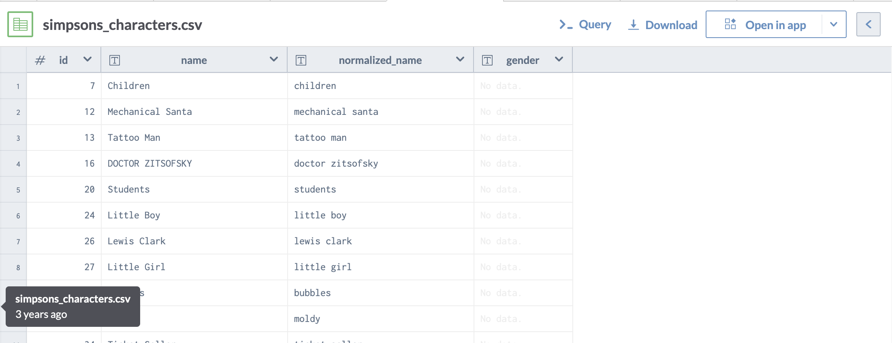

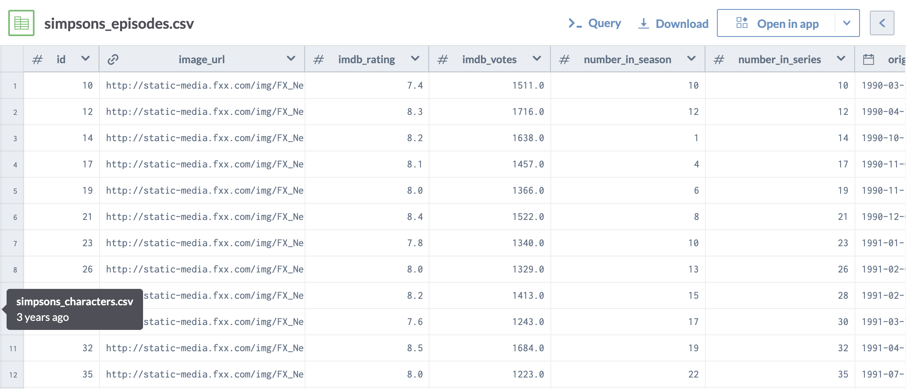

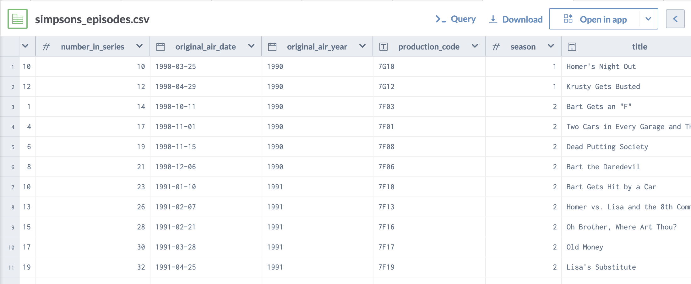

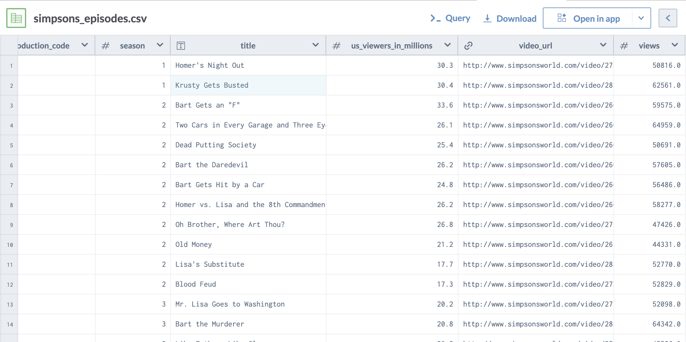

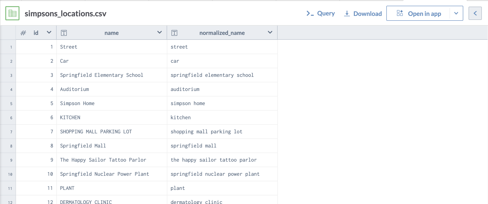

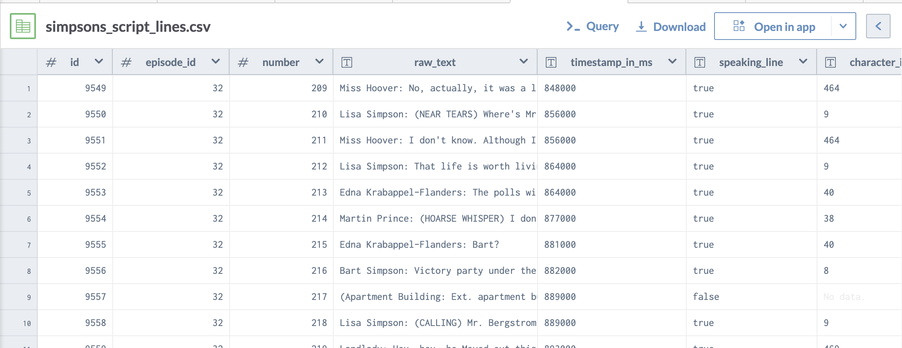

### Potential drop down menu / search filter / visualization toggle specifications that user could make:
* Character
* Word or phrase 
* Episode or season
* Location (setting in which dialogue occurs) 

### Potential comparative variables: 
* Season or episode rating/ viewing numbers

### Potential visualizations:

Bar Graph (for a given episode)
* Compares frequency of one string to another
* Or could compare distribution of dialogue amongst characters 

Line Graph (for a given catchphrase) 
* X axis: seasons/episodes (toggle?)
* Y axis: frequency of given string (can pick which string?)

Line Graph with shading (AKA area graph) (user chooses catch phrase from dropdown)
* X axis: seasons (chronological)
* Y axis is the average percent of lines the given character contributed each episode per season.

Bubble scatter (user chooses catchphrase from dropdown)
* Bubble size is frequency of given string
* X axis is air date
* Y axis is episode rating 

### Inspirational Findings:

* [website 1](https://towardsdatascience.com/the-simpsons-meets-data-visualization-ef8ef0819d13):

    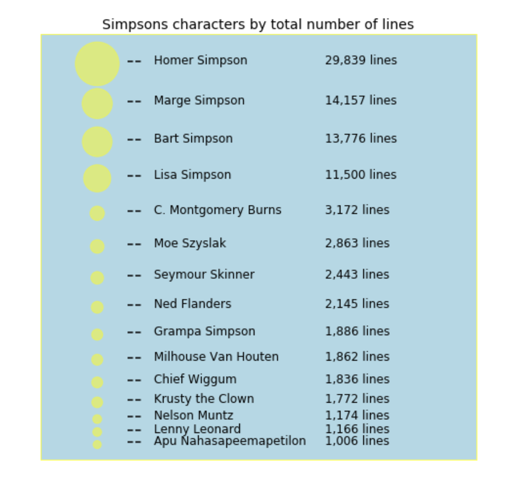
    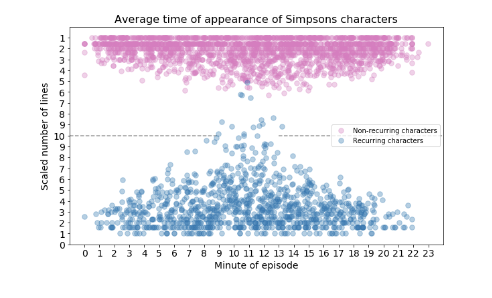
    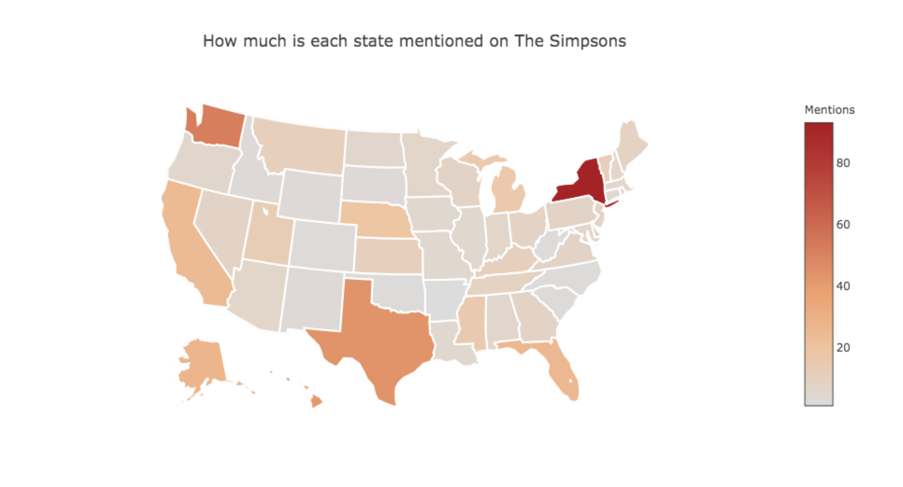

* [website 2](https://pudding.cool/2017/08/the-office/):

    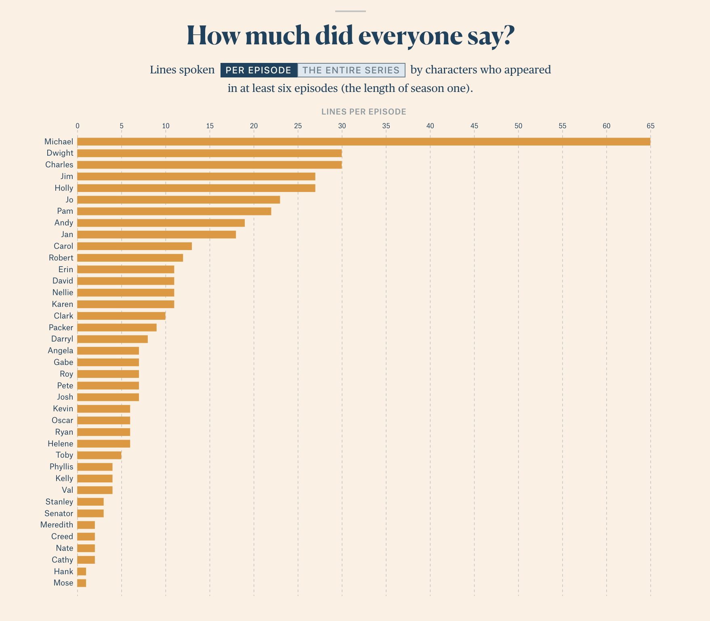
    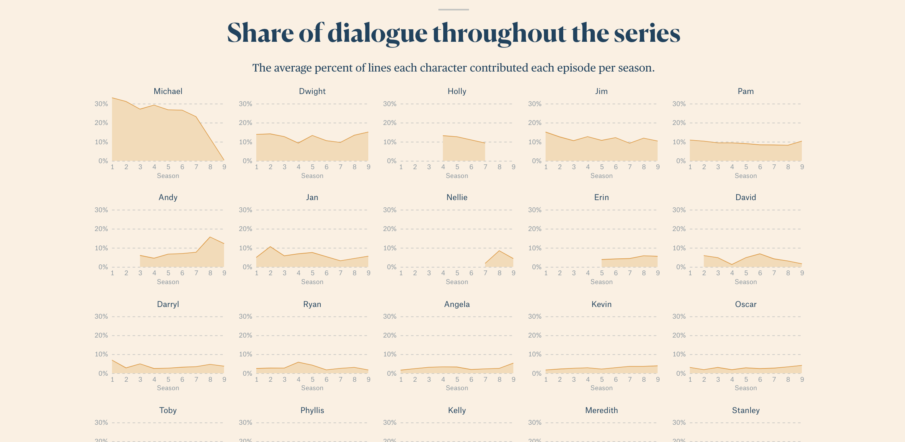

* [website 3](https://toddwschneider.com/posts/the-simpsons-by-the-data/):

    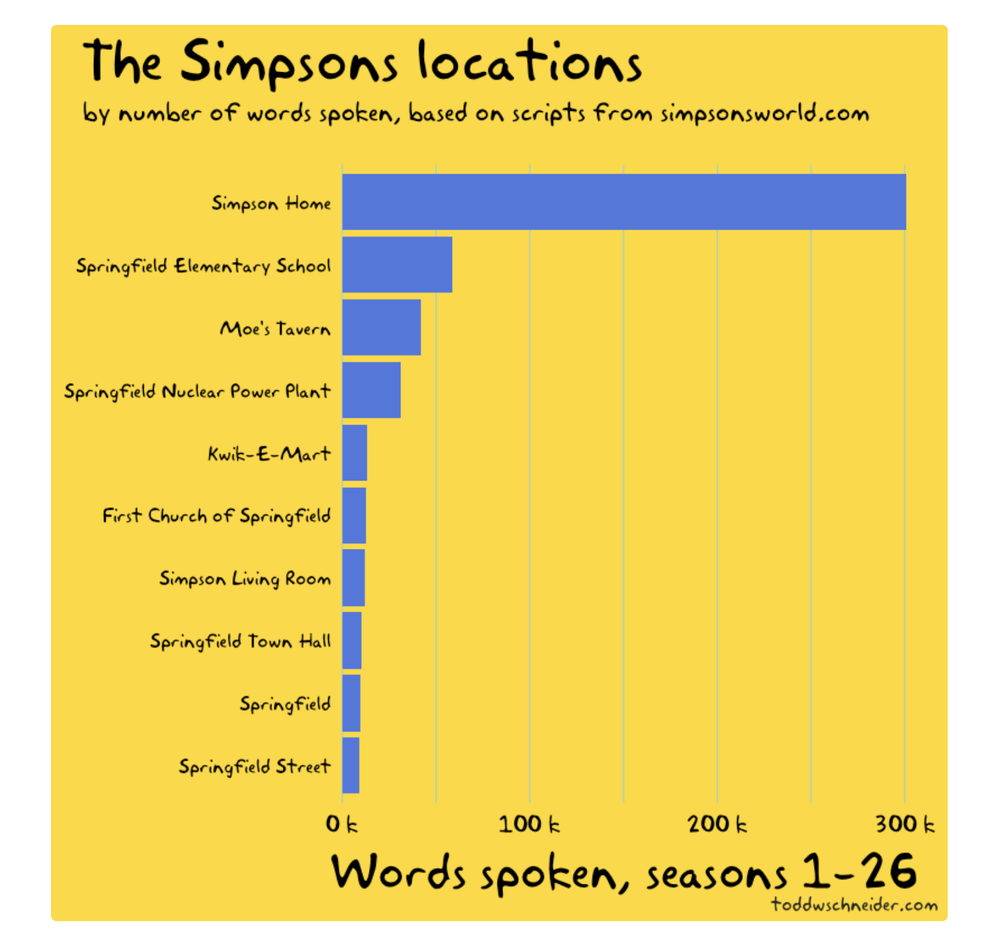
    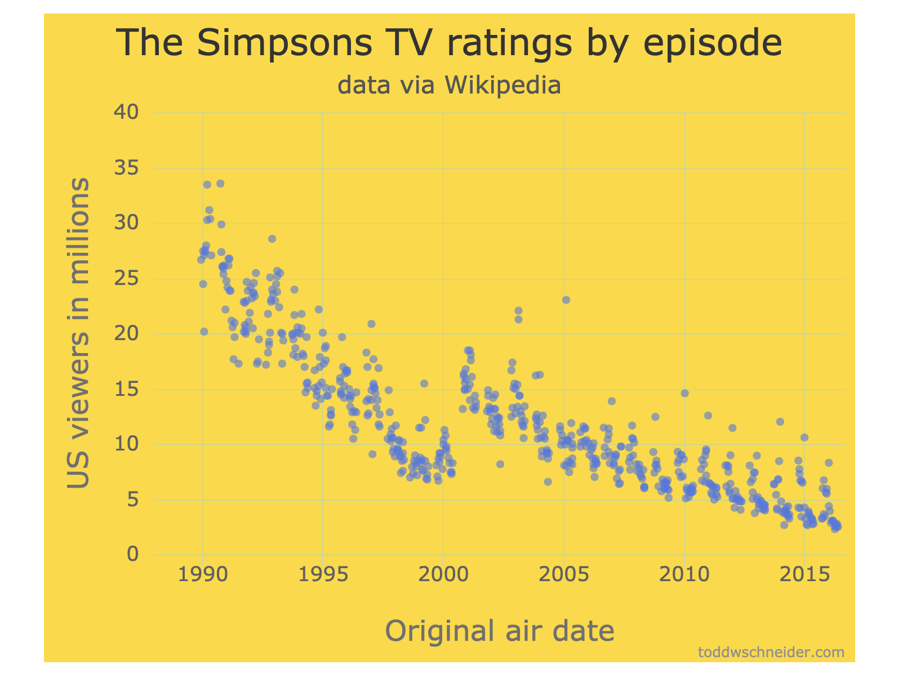

### Sketch from Ty:

    

### Additional JavaScript library: “chart.js”
* Good documentation
* Commonly used
